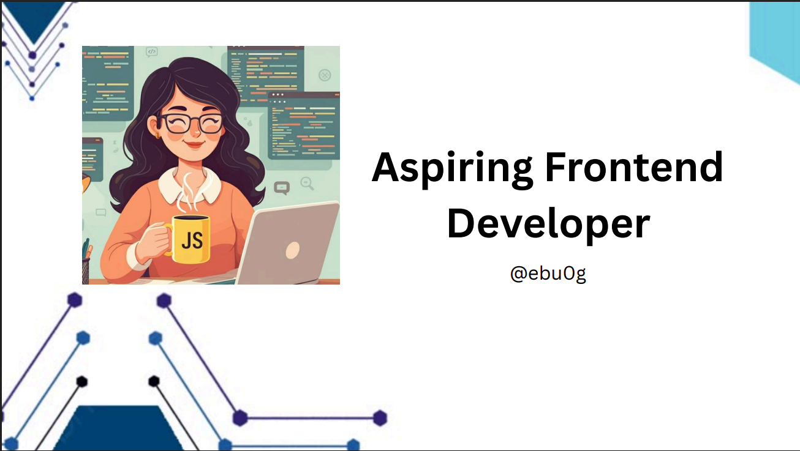

# Hi there, I'm Ebawak! 👋

## About Me 🚀

I'm a passionate **Frontend Developer** currently learning at **ALX** and studying Software Engineering at **AASTU**. I enjoy turning designs into real, interactive web experiences, and I'm working hard to grow my skills daily.

- 🌱 Currently learning: **HTML, CSS, JavaScript, Git, and responsive design**
- 🔭 Working on: **My portfolio website and ALX frontend challenges**
- 🌍 Languages: **JavaScript, C++, Amharic, English**
- 📫 How to reach me: **gebawak@gmail.com**
- ⚡ Fun fact: I love solving puzzles and exploring UI design!

## My Skills 🧠

## Featured Projects 💻

### [Airplane Management System (C++)](https://github.com/ebu0g/project-t)

A console-based C++ application that manages airplane flights, handles passenger data, and allows basic scheduling. Built using Object-Oriented Programming and file handling.  
🔗 [View on GitHub](https://github.com/ebu0g/project-t)

### [Department Recommendation Website](https://github.com/ebu0g/Ip-project)

A responsive website built using HTML, CSS, and JavaScript that helps freshman students choose their ideal department based on input and interest areas.  
🔗 [View on GitHub](https://github.com/ebu0g/Ip-project)

## Get in Touch 📬

- 🌐 [LinkedIn](https://www.linkedin.com/in/ebawakgebisa)
- 💻 [GitHub](https://github.com/ebu0g)
- 📫 **Email**: gebawak@gmail.com
